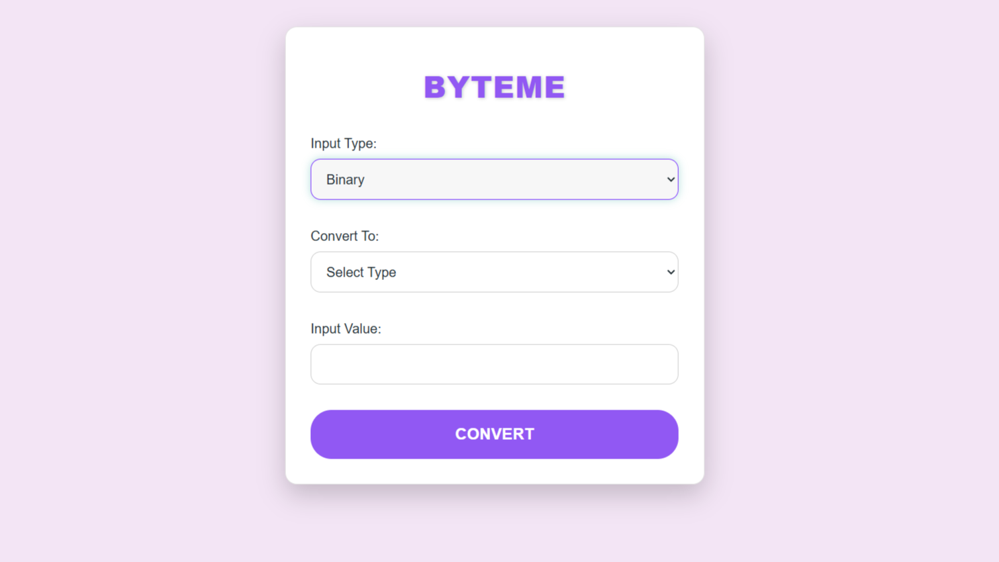
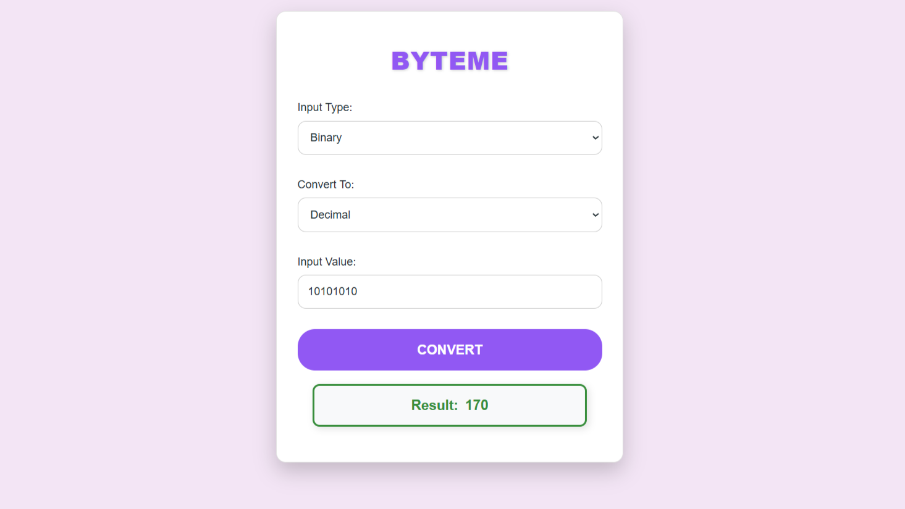
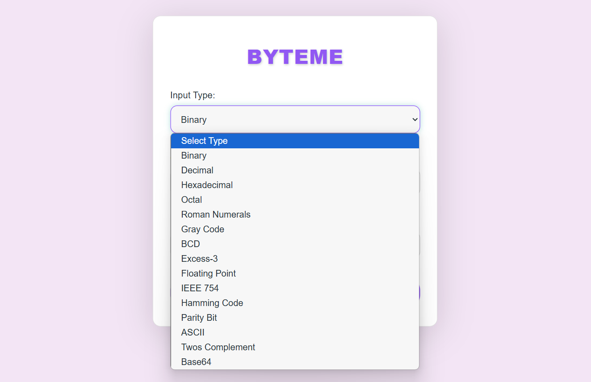
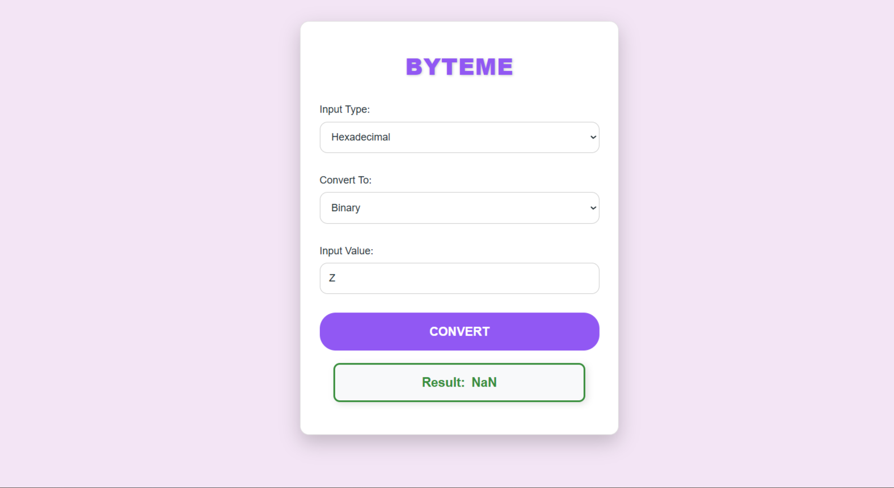
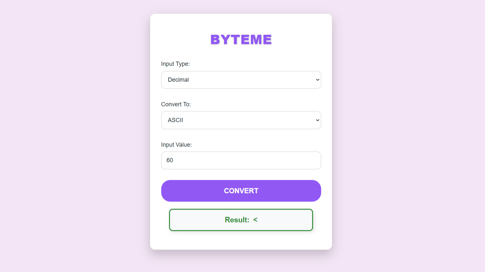

# **ByteMe - The Ultimate Conversion Tool**  


## **About ByteMe**  
ByteMe is a **powerful, multi-directional conversion tool** that supports **53 different conversion types**! Whether you need to convert **binary, decimal, hexadecimal, octal, IEEE 754, ASCII, Unicode, floating-point, BCD, Gray code**, or even **Roman numerals**, ByteMe has got you covered.  

With an interactive, real-time conversion, and a clean, user-friendly UI, ByteMe makes number system conversions **easier than ever**!  

## **Getting Started**

### Prerequisites
- Node.js (v14 or higher)
- npm (v6 or higher)

### Installation
1. Clone the repository
```bash
git clone https://github.com/PushkarPisolkar04/ByteMe
cd byteme
```

2. Install dependencies
```bash
npm run install-all
```

3. Create environment files
```bash
# Frontend (.env)
VITE_API_URL=http://localhost:5000

# Backend (.env)
PORT=5000
NODE_ENV=development
CORS_ORIGIN=http://localhost:5173
```

4. Start the development server
```bash
npm run dev
```

The application will be available at:
- Frontend: http://localhost:5173
- Backend: http://localhost:5000

### Production Build
```bash
npm run build
npm start
```

## License
This project is licensed under the MIT License - see the [LICENSE](LICENSE) file for details.

## Author
[Pushkar Pisolkar](https://github.com/PushkarPisolkar04)

---

## **Screenshots**  

## 🖥️ Screenshots

### 1️⃣ **Homepage UI**


### 2️⃣ **Binary to Decimal Conversion**


### 3️⃣ **Conversions**


### 4️⃣ **Error Handling & Validation**


### 5️⃣**Example**



🛠️ Tech Stack
Frontend: React.js / Next.js  
Backend: Node.js / Express  
Database: N/A (no persistence needed)  
Other Tools: Vite, Tailwind CSS  

